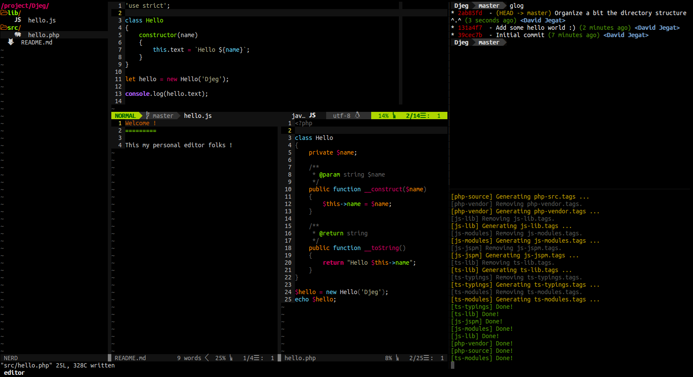

My Editor
=========

Hello folks this is a simple and public repository of my personal editor base
on docker.

## Requirements

- A black terminal
- Docker (with docker-compose)
- `git`

## Installation

1. Clone the repository `git clone --recursive https://github.com/Djeg/my-editor.git editor`.
2. Go inside the repository `cd editor`.
5. Export your project environment variable `export PROJECT_FOLDER=/path/to/my/projects`
5. Export your ssh folder variable `export SSH=/home/my-user/.ssh`
4. Install the font located under `font` and configure it for your terminal.
3. Run `docker-compose up` (this could take a while ...).
6. Finally run `docker-compose run editor`

All your project should be shared and located under `/project`.

Enjoy !
